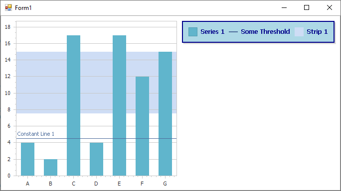

<!-- default badges list -->

<!-- default badges end -->

# Chart for WinForms - How to Customize the Appearance of the Chart Legend 

This example demonstrates how to access the chart [legend](https://docs.devexpress.com/WindowsForms/5794/controls-and-libraries/chart-control/legends)'s settings to customize the legend's appearance at runtime.

To specify whether [constant lines](https://docs.devexpress.com/WindowsForms/5783/controls-and-libraries/chart-control/axes/constant-lines?p=netframework) and [strips](https://docs.devexpress.com/WindowsForms/5784/controls-and-libraries/chart-control/axes/strips?p=netframework) should be shown in the legend, set their `ShowInLegend` property to `true`.

## Files to Review

[Form1.cs](./CS/ChartLegend/Form1.cs) (VB: [Form1.vb](./VB/ChartLegend/Form1.vb))

## Documentation

[Legends](https://docs.devexpress.com/WindowsForms/5794/controls-and-libraries/chart-control/legends)
